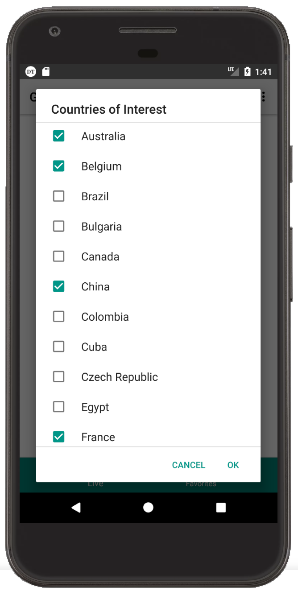
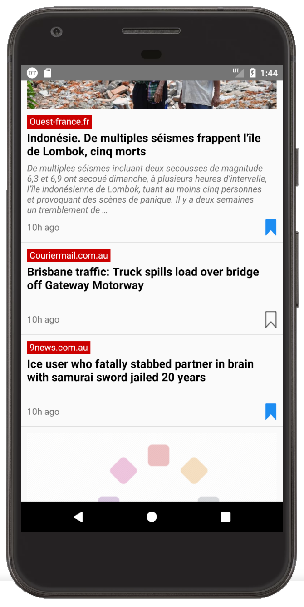
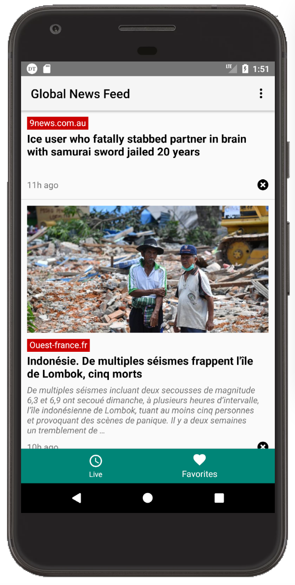

# Global News Bookmark
A news aggregator that allows users to configure the sources of countries to subscribe. Users can save articles in their bookmark to read later as well.

  
  
  
  

# TODO
1. Search Articles with Specific Keywords
2. Deep Linking in Push Notification
